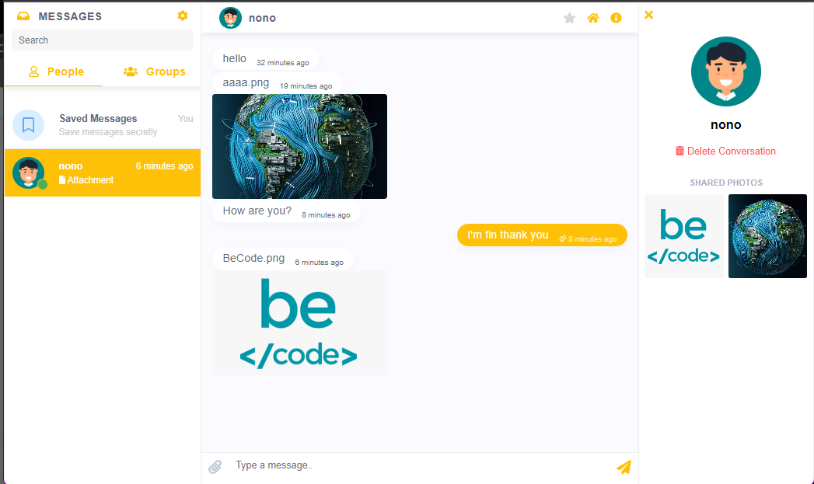

# Laravel live Chat by Chatify

## About project

A chat room that allows you to send messages or images to each other through the Chatify service

## Used technology

-   Laravel 9
-   Munafio/Chatify
-   Pusher
-   Laravel/Breeze

## Options avalable

- Night mode
- Delete or send a message/image
- Live search bar
- Update profile picture
- Zoom on medias
- Summary of media received by the user
- Change the color of the interface

## Screenshots

